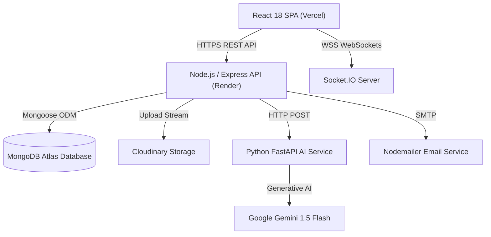

# SkillBridge AI — Production Deployment Guide & Infrastructure Playbook

This document provides step-by-step instructions for deploying SkillBridge AI to cloud production environments (Vercel for Frontend, Render/Railway for Express Backend, Docker/Render for FastAPI AI Microservice, MongoDB Atlas for Database, and Cloudinary for Media Storage).

---

## 🏗️ System Architecture Overview



---

## 🔑 Environment Variables Checklist

### 1. Backend Server (`server/.env`)
```env
PORT=5000
NODE_ENV=production
MONGODB_URI=mongodb+srv://<user>:<password>@cluster.mongodb.net/skillbridge_ai?retryWrites=true&w=majority
JWT_SECRET=your_super_secret_jwt_access_key_2026_prod
JWT_REFRESH_SECRET=your_super_secret_jwt_refresh_key_2026_prod
CLIENT_URL=https://skillbridge-ai.vercel.app
AI_SERVICE_URL=https://skillbridge-ai-service.onrender.com
AI_SHARED_SECRET=skillbridge_secret_ai_key_2026

# Cloudinary Storage Credentials
CLOUDINARY_CLOUD_NAME=your_cloudinary_cloud_name
CLOUDINARY_API_KEY=your_cloudinary_api_key
CLOUDINARY_API_SECRET=your_cloudinary_api_secret

# SMTP Email Automation Credentials
SMTP_HOST=smtp.sendgrid.net
SMTP_PORT=587
SMTP_USER=apikey
SMTP_PASS=your_sendgrid_or_gmail_app_password
EMAIL_FROM_NAME=SkillBridge AI
EMAIL_FROM_ADDRESS=noreply@skillbridge.ai
```

### 2. Frontend Client (`client/.env.production`)
```env
VITE_API_BASE_URL=https://skillbridge-backend.onrender.com
VITE_SOCKET_URL=https://skillbridge-backend.onrender.com
```

### 3. FastAPI AI Service (`ai-service/.env`)
```env
PORT=8000
GEMINI_API_KEY=your_google_gemini_api_key
AI_SHARED_SECRET=skillbridge_secret_ai_key_2026
```

---

## 🚀 Deployment Instructions

### 1. Frontend Deployment (Vercel)
1. Push repository code to GitHub.
2. Log into [Vercel Dashboard](https://vercel.com) and click **"Add New Project"**.
3. Import the `SkillBridge AI` repository and set Root Directory to `client`.
4. Configure Build Command: `npm run build` and Output Directory: `dist`.
5. Add Environment Variable:
   - `VITE_API_BASE_URL` = `https://skillbridge-backend.onrender.com`
6. Click **Deploy**. Vercel will automatically apply single-page application routing rules defined in `client/vercel.json`.

---

### 2. Backend API Deployment (Render / Railway)
1. Log into [Render Dashboard](https://render.com) and select **"New Web Service"**.
2. Connect your GitHub repo and select `server` directory.
3. Configure Environment: `Node`.
4. Set Build Command: `npm install`
5. Set Start Command: `node server.js`
6. Enter all environment variables listed in the **Backend Server** checklist above.
7. Click **Create Web Service**.

---

### 3. AI Microservice Deployment (Render Docker)
1. In Render, click **"New Web Service"** and point to the `ai-service` directory.
2. Select **Runtime: Docker** (Render will automatically detect `ai-service/Dockerfile`).
3. Add Environment Variable: `GEMINI_API_KEY`.
4. Click **Deploy**.

---

## 🏥 Health Diagnostics & Verification

Verify production service readiness using the automated diagnostic endpoint:
```bash
curl -X GET https://skillbridge-backend.onrender.com/api/v1/health
```

Expected HTTP 200 OK Response:
```json
{
  "success": true,
  "data": {
    "status": "OK",
    "timestamp": "2026-07-30T14:47:00.000Z",
    "uptimeSeconds": 86400,
    "environment": "production",
    "services": {
      "database": {
        "status": "Healthy",
        "name": "skillbridge_ai"
      },
      "aiMicroservice": {
        "status": "Operational"
      }
    }
  }
}
```

---

## 🔄 Rollback Procedures & Troubleshooting

### 1. Database Connectivity Failure
- **Symptom**: `GET /api/v1/health` returns `status: DEGRADED`.
- **Fix**: Check MongoDB Atlas Network Access IP Whitelist. Allow `0.0.0.0/0` or add Render outbound IP addresses.

### 2. CORS Error on Client Request
- **Symptom**: Browser console throws CORS blocked origin.
- **Fix**: Ensure `CLIENT_URL` in `server/.env` exactly matches your Vercel production domain (including `https://`).

### 3. Immediate Rollback Trigger
- To revert to a previous production release on Render or Vercel, navigate to the **Deploys** tab, select the last green successful build commit, and click **"Rollback to this Deploy"**.
